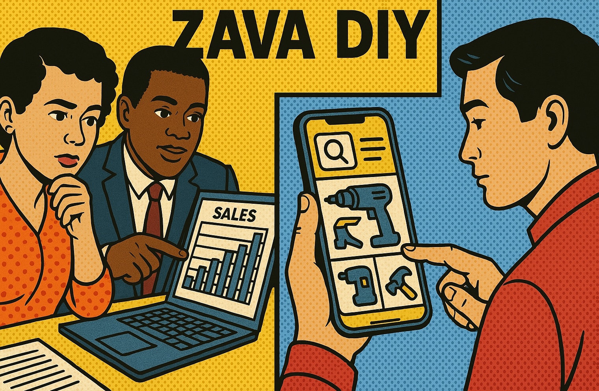

# Unlock your agents potential with Model Context Protocol and PostgreSQL Workshop

## A 75-minute interactive workshop

Imagine you are a sales manager at Zava, a retail DIY company with stores across Washington State and a growing online presence. You specialize in outdoor equipment, home improvement tools, and DIY supplies. You need to analyze sales data to find trends, understand customer preferences, and make informed business decisions. To help you, Zava has developed a conversational agent that can answer questions about your sales data and even help customers find products using image search.

## What is an LLM-Powered AI Agent?

A Large Language Model (LLM) powered AI Agent is semi-autonomous software designed to achieve a given goal without requiring predefined steps or processes. Instead of following explicitly programmed instructions, the agent determines how to accomplish a task using instructions and context.

For example, if a user asks, "**Show the total sales by region as a pie chart**", the app doesn't rely on predefined logic for this request. Instead, the LLM interprets the request, manages the conversation flow and context, and orchestrates the necessary actions to produce the regional sales pie chart.

Unlike traditional applications, where developers define the logic and workflows to support business processes, AI Agents shift this responsibility to the LLM. In these systems, prompt engineering, clear instructions, and tool development are critical to ensuring the app performs as intended.

## Introduction to the Azure AI Foundry

[Azure AI Foundry](https://azure.microsoft.com/products/ai-foundry/){:target="_blank"} is Microsoft’s secure, flexible platform for designing, customizing, and managing AI apps and agents. Everything—models, agents, tools, and observability—lives behind a single portal, SDK, and REST endpoint, so you can ship to cloud or edge with governance and cost controls in place from day one.

## What is the Foundry Agent Service?

The Foundry Agent Service offers a fully managed cloud service with SDKs for [Python](https://learn.microsoft.com/azure/ai-services/agents/quickstart?pivots=programming-language-python-azure){:target="_blank"}, [C#](https://learn.microsoft.com/azure/ai-services/agents/quickstart?pivots=programming-language-csharp){:target="_blank"}, and [TypeScript](https://learn.microsoft.com/en-us/azure/ai-foundry/agents/quickstart?pivots=programming-language-typescript){:target="_blank"}. It simplifies AI agent development, reducing complex tasks like tool calling to just a few lines of code.

!!! info
    MCP (Model Context Protocol) provides a standardized way to connect LLMs to external tools and systems. Unlike traditional function calling, MCP offers a more robust, secure, and scalable approach to tool integration, enabling sophisticated interactions between AI agents and data sources.

The Foundry Agent Service offers several advantages over traditional agent platforms:

- **Rapid Deployment**: Optimized SDK for fast deployment, letting developers focus on building agents.
- **Scalability**: Designed to handle varying user loads without performance issues.
- **Custom Integrations**: Supports MCP (Model Context Protocol) for robust tool integration and external data access.
- **Built-in Tools**: Includes Fabric, SharePoint, Azure AI Search, and Azure Storage for quick development.
- **RAG-Style Search**: Features a built-in vector store for efficient file and semantic search.
- **Conversation State Management**: Maintains context across multiple interactions.
- **AI Model Compatibility**: Works with various AI models.

Learn more about the Foundry Agent Service in the [Foundry Agent Service documentation](https://learn.microsoft.com/azure/ai-services/agents/overview){:target="_blank"}.

## Introduction to the Model Context Protocol (MCP)

The [Model Context Protocol (MCP)](https://modelcontextprotocol.io/){:target="_blank"} is an open standard that enables secure, controlled access to resources for Large Language Models (LLMs). Developed by Anthropic, MCP provides a universal protocol for connecting AI assistants to various data sources and tools, ensuring efficient and secure interactions.

### Key Benefits of MCP

- **Standardized Integration**: MCP provides a consistent way to connect LLMs to external data sources and tools
- **Security**: Built-in access controls and secure communication between the LLM and external resources  
- **Flexibility**: Support for various data sources including databases, APIs, file systems, and more
- **Performance**: Efficient data transfer and caching mechanisms for optimal response times

### MCP in the Zava Sales Agent

In this workshop, the MCP server acts as the bridge between the Azure AI Agent and the PostgreSQL database containing Zava's sales data. When you ask questions about products, sales trends, or inventory, the MCP server:

1. **Receives Tool Calls**: The LLM generates tool calls based on your natural language queries
2. **Executes Database Operations**: The MCP server safely executes SQL queries against the PostgreSQL database
3. **Provides Schema Information**: Dynamically provides table schemas and relationships to help the LLM generate accurate queries
4. **Enables Image Search**: Leverages PostgreSQL's pgvector extension for AI-powered product image similarity searches
5. **Returns Structured Data**: Sends formatted results back to the LLM for natural language responses
6. **Provides Time Services**: Uses the MCP server to access time-related data, such as current date and time, which can be useful for generating time-sensitive reports or analyses.

This architecture allows the agent to provide real-time insights about Zava's operations while maintaining security and performance.st agent with Azure AI Foundry

## AI Agent Frameworks

Popular agent frameworks include LangChain, Semantic Kernel, and CrewAI. What distinguishes the Foundry Agent Service is its seamless integration capabilities and an SDK optimized for rapid deployment. In complex multi-agent scenarios, solutions will combine SDKs like Semantic Kernel and AutoGen with the Foundry Agent Service to build robust and scalable systems.
